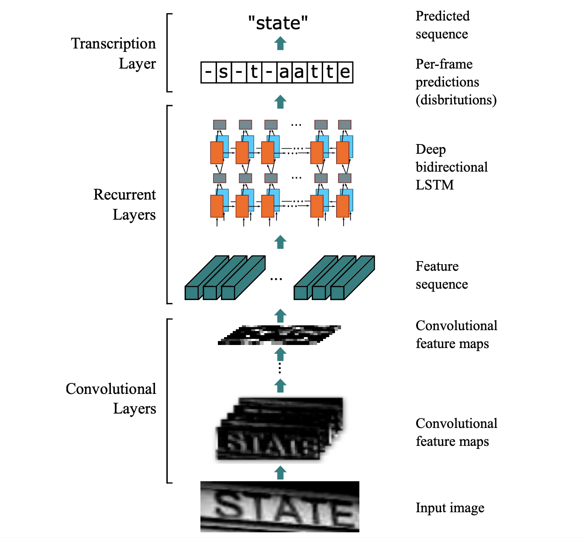
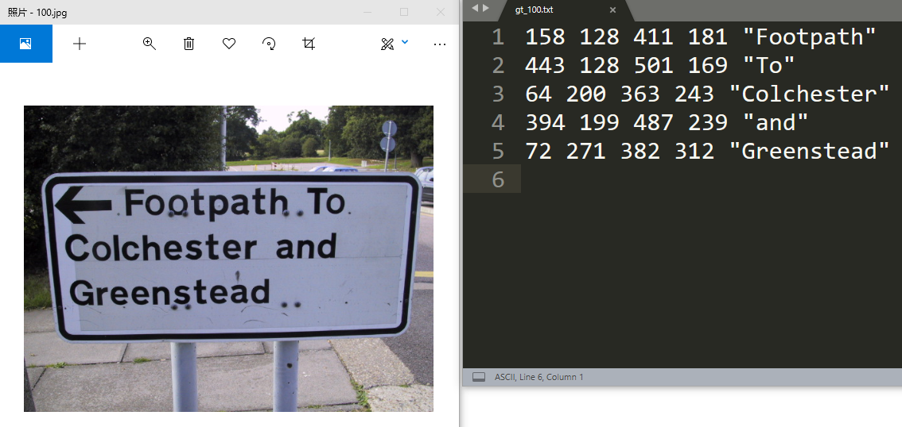
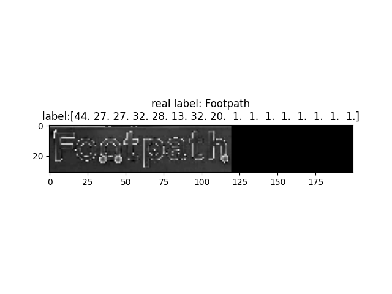
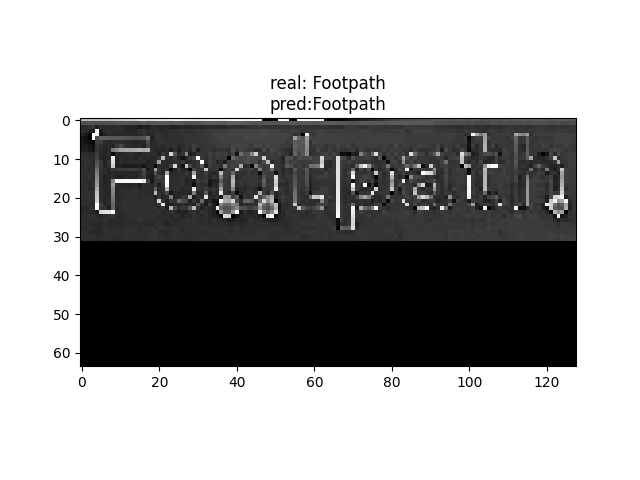

# OCR：CRNN+CTC

场景文字识别OCR的应用场景非常多，其中一个经典的end2end模型是[CRNN+CTC](https://arxiv.org/abs/1507.05717)。

本项目是[CRNN+CTC](https://arxiv.org/abs/1507.05717)的TensorFlow2的代码，可以用这个模型实现对变长文字的识别功能。

CRNN模型是CNN模型和RNN模型组合而成的模型。CNN模型用于对图片进行特征处理，RNN用于生成序列特征。

**CRNN网络结构 ：**

1. 卷积层：从输入图像中提取特征序列；

2. 循环层，预测每一帧的标签分布； 

3. 转录层，将每一帧的预测变为最终的标签序列。





## 1、数据集

### 1.1 数据集介绍
数据集来自国际文档分析与识别大会（International Conference on Document Analysis and Recognition, ICDAR）的Focused Scene Text比赛的 [Task 2.1: Text Localization (2013 edition) 数据集](https://rrc.cvc.uab.es/?ch=2&com=tasks)。



```
└─data
   ├─train
   │  ├─images（样本图片）
   │  └─ground_truth（样本标注：由坐标和文字字符组成）
   └─test
      ├─images（样本图片）
      └─ground_truth（样本标注：由坐标和文字字符组成）
```


### 1.2 数据预处理

由于本项目任务是**识别文字阶段**。

所以先用`dataprocessing.py`对数据集进行处理，提取出有文字的图片。

之后运行`dataset.py`制作数据集



## 2、Training

```python
python train.py
```


